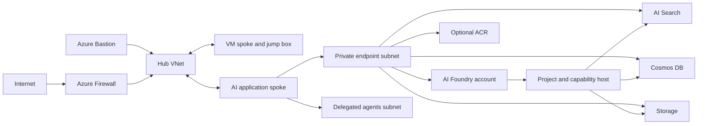

# Azure AI Foundry private network stack (Terraform)

Terraform conversion of the sibling `foundry-bicep` deployment. The Bicep source remains unchanged. This root creates the resource group and the complete hub/spoke Foundry environment; `add-project/` and `tool-servers/azure-function-server/` are separate Terraform states.

## Architecture



## Provider split

- AzureRM owns stable resources: networking, Firewall, Bastion, VM, DNS, private endpoints, Storage, Search, Cosmos DB, ACR, diagnostics, and control-plane RBAC.
- AzAPI owns the `2025-04-01-preview` AI Foundry account, model deployment, project, connections, capability host, and the Cosmos SQL data-plane role assignment.
- Capability-host schema validation is disabled only for that resource because the current preview schema omits runtime-required `capabilityHostKind`, matching the suppression in the Bicep source.

## Prerequisites

- Terraform 1.8 or newer
- An Azure identity authenticated through the normal AzureRM credential chain
- Permission to create resource groups, networking, Microsoft.CognitiveServices resources, and role assignments
- Registered resource providers for the services in this stack
- Regional model quota for the selected model deployment

## Deploy the main stack

```powershell
Set-Location foundry-terraform
Copy-Item terraform.tfvars.example terraform.tfvars
$env:TF_VAR_admin_password = '<supply outside source control>'
terraform init
terraform plan -out main.tfplan
terraform apply main.tfplan
```

Use a remote Azure Storage backend for shared or production usage. Backend settings are intentionally not hardcoded; initialize with `terraform init -backend-config=backend.hcl` after creating a gitignored backend file.

## Feature toggles

`firewall_enabled`, `bastion_enabled`, `vm_enabled`, and `container_registry_enabled` preserve the Bicep toggles. When Firewall is disabled, route-table resources and associations are omitted. Set `developer_ip_cidr` to enable ACR public access with deny-by-default IP filtering; leave it empty for private endpoint only.

The VM password is sensitive and should be supplied as `TF_VAR_admin_password` or through a secret-aware CI variable. Terraform state contains sensitive infrastructure values and must be encrypted and access-controlled.

## Additional roots

- `add-project/`: creates another project, connections, capability host, and per-project roles against existing shared resources. It has its own state because it is a post-deployment workflow.
- `tool-servers/azure-function-server/`: creates the VNet-integrated Python Function App infrastructure from the original `deploy-function.bicep`. Publish the Python application separately after apply.

## Existing resources and migration

This conversion creates new resources by default. To adopt an existing Bicep deployment, set names/suffixes to match and import every resource before planning. Preview AzAPI resources use their full ARM IDs with `terraform import`. Review the first plan carefully; do not apply a plan that proposes replacement of live resources.

## Security notes

The Foundry dependencies disable public network access, Storage shared-key access, and Cosmos local authentication. Private DNS is linked to all three VNets. The project identity receives only the roles from the source template, including Cosmos DB Built-in Data Contributor `00000000-0000-0000-0000-000000000002` and a workspace-scoped Storage ABAC condition. The diagnostic archive account remains publicly addressable over TLS, matching the source; access is still authorization-controlled.